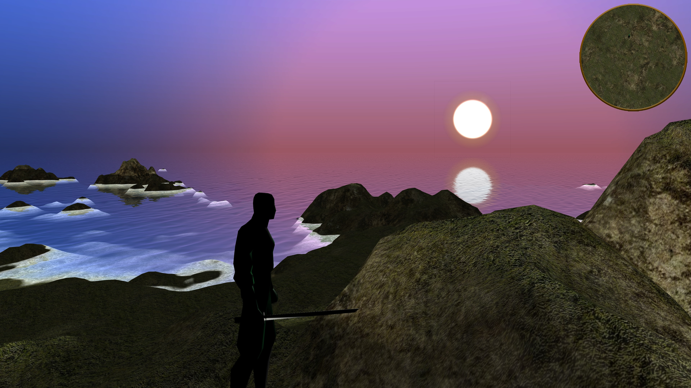

# ANJRpg
Alexander's Nilov Java Role Playing Game (ANJRpg).

An Open Source Action RPG game written in Java.

mailto: <arifolth@gmail.com>

#


## Build

Use [Maven](https://maven.apache.org/) to build the ANJRpg.

```bash
mvn install
```
## Run
```bash
mvn exec:java -pl GameClient -Djvm.options="-XX:-TieredCompilation -XX:TieredStopAtLevel=3 -server -XX:+UnlockExperimentalVMOptions -XX:+UseZGC"
```
## About game
Features borderless procedurally generated world
Day and Night Cycle
Weather effects
Physics 
Enemies with AI and Combat System
Animated models
Sounds
UI
Loading Screen and Main Menu

## Repo

<https://github.com/Arifolth/jme3rpg>

## Materials used
- Java sources of [Mtnrim_v0.zip](https://sourceforge.net/projects/mountainrim/)
- Sounds from https://freesound.org/
- Other resources, credit is given in the code

## License
[GPLv3](https://www.gnu.org/licenses/gpl-3.0.txt)

#### Copyright 2021 &copy; Alexander Nilov