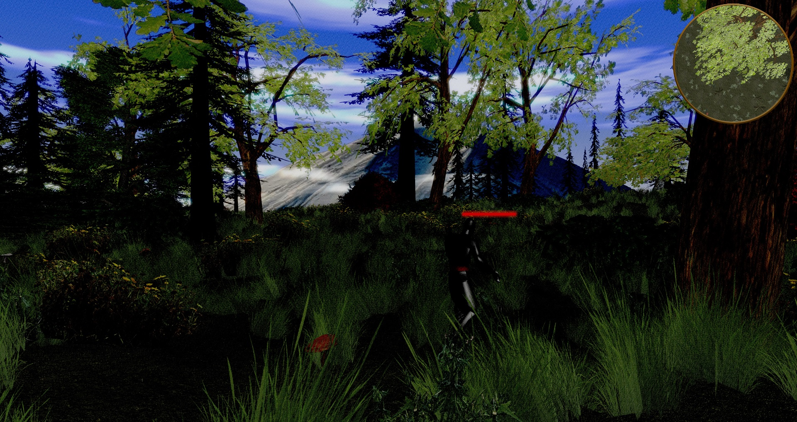
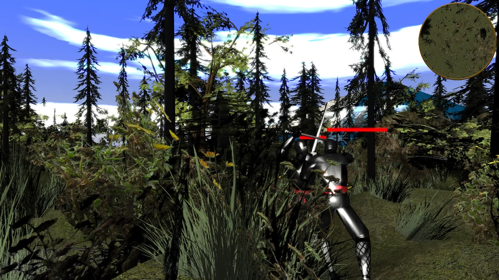
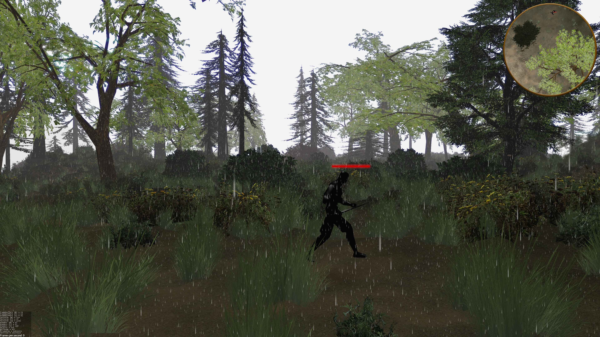
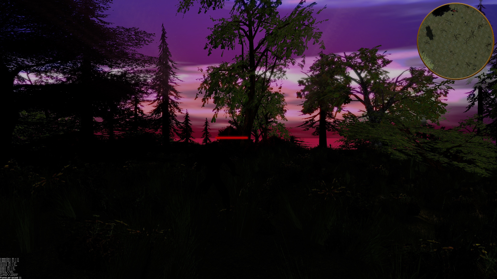
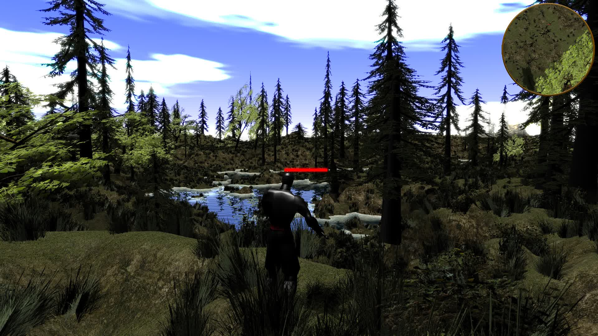
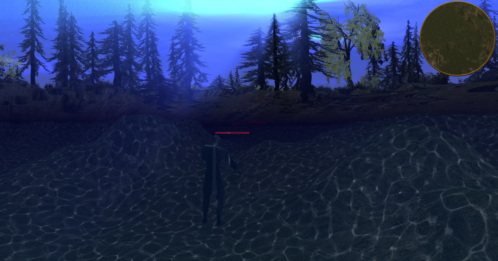
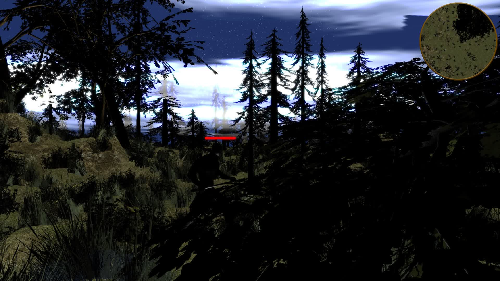
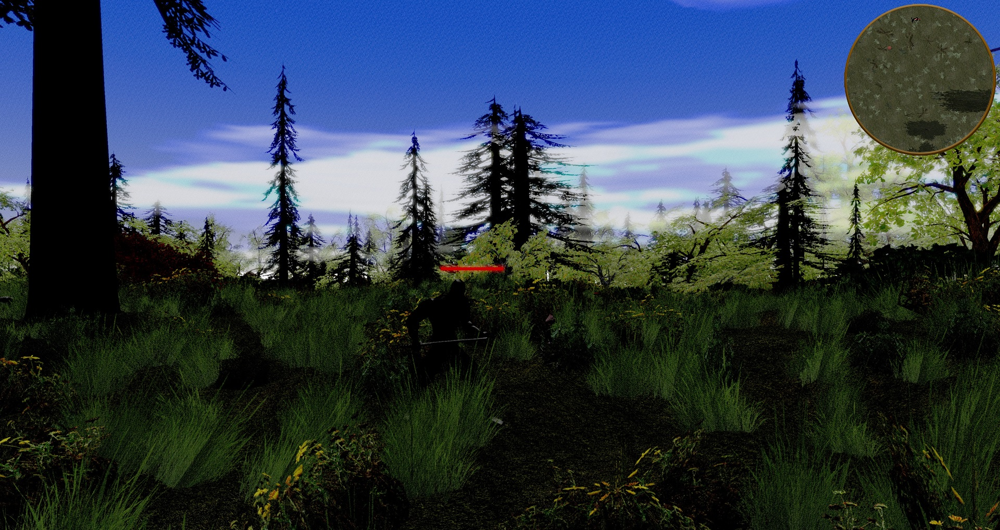

# ANJRpg
Alexander's Nilov Java Role Playing Game (ANJRpg).
An Open Source Action RPG game written in Java.

mailto: <arifolth@gmail.com>

#

## Features:
- Modular Maven build
- Borderless procedurally generated world (Work In Progress)
- Day and Night Cycle 
- Weather effects (Work In Progress)
- Physics 
- Enemies with AI and Combat System
- Animated models
- Environmental and combat sounds
- UI
- Loading Screen and Main Menu
- Native launcher (executable with bundled jre)

## Gameplay Keys
Default bindings:
- W - move forward
- S - move backwards
- A - move left
- D - move right
- SHIFT + W or SHIFT + S - RUN
- LEFT_MOUSE - attack
- MIDDLE_MOUSE - hold to move camera around the player
- RIGHT_MOUSE - block (hold)
- SPACE - jump

## Hardware requirements
- Monitor with at least 1920x1080 resolution
- Decent videocard with 2Gb of Video RAM

For better performance you may want to run the game on a dedicated gaming video card specifically, if you have one.

## Build
Use [Maven](https://maven.apache.org/) to build the ANJRpg. 
JDK 17+ is required to build and run the game.

```bash
mvn install
```

### Native executables
Native executables ware tested to build and run successfully on a Windows box.

To build them enable profile 
```native``` and perform a [Launcher](Launcher) module build  

## Run using Jdk
```bash
mvn exec:java -pl GameClient -Djvm.options="-Xmx8G -server -XX:+UseZGC -XX:+ZProactive -XX:+UseStringDeduplication -XX:+UseLargePages"
```

## Repo
<https://github.com/Arifolth/jme3rpg>

## Materials used
- [Mtnrim_v0.zip](https://sourceforge.net/projects/mountainrim/)
- https://github.com/rdok/Arcem-Tutari
- Sounds from https://freesound.org/
- Tree models and Grass textures from BioMonkey
- Other resources, credit is given in the code

## Screenshots








## License
It is released under the [GNU General Public License v3.0](https://www.gnu.org/licenses/gpl-3.0.txt)

#### Copyright 2014 - 2024 &copy; Alexander Nilov